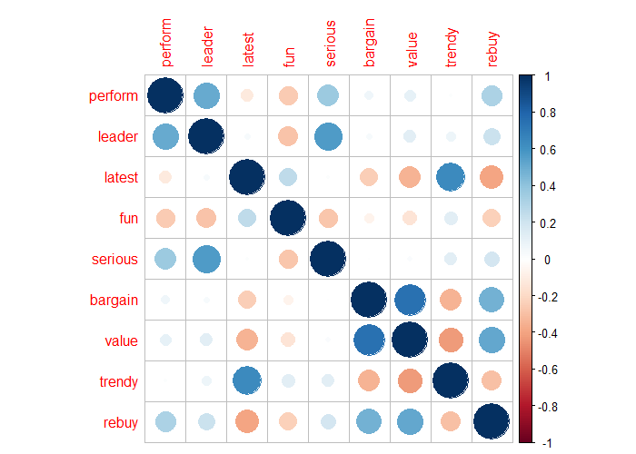
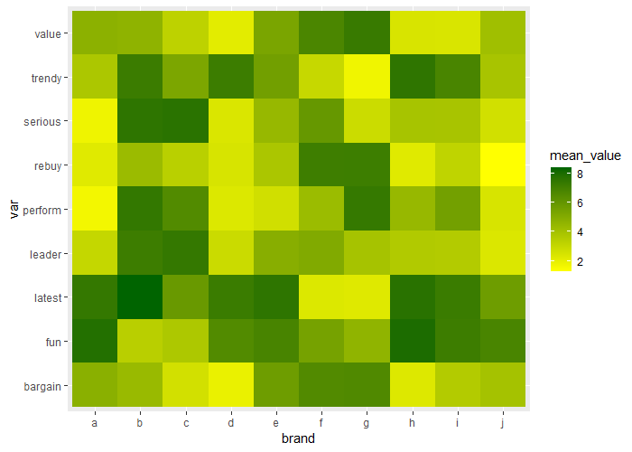
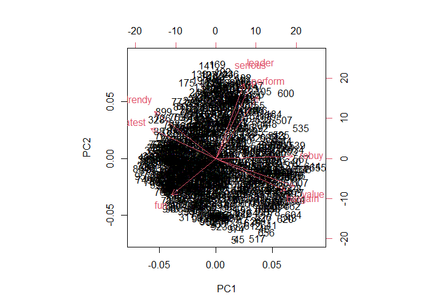
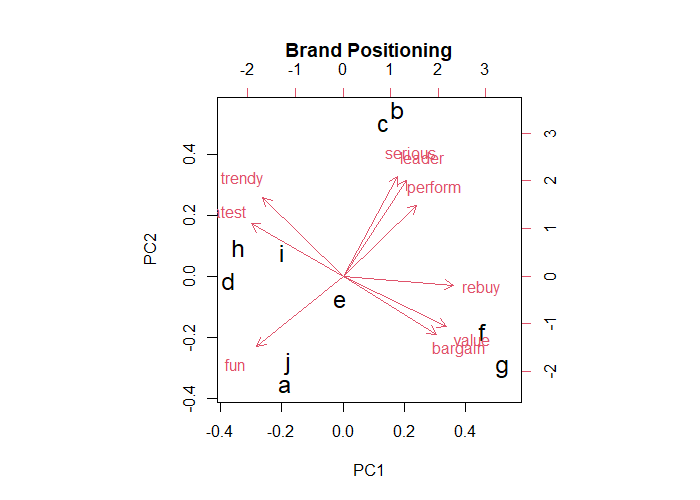

# R_CS_10
Dimension Reduction in R

### Case-Study Title: Brand Perceptual Map (use PCA for data interpretation)
### Data Analysis methodology: CRISP-DM
### Dataset: 100 Customers answered 9 questions about 10 brands by likerd spectrum
### Case Goal: Knowing market atmosphere and Brand Positioning (know situation of 10 different Brands)

Correlation table between continuous features

Heat-Map of mean score of every brand in each feature

Perceptual Map for all products

Perceptual Map for brands

